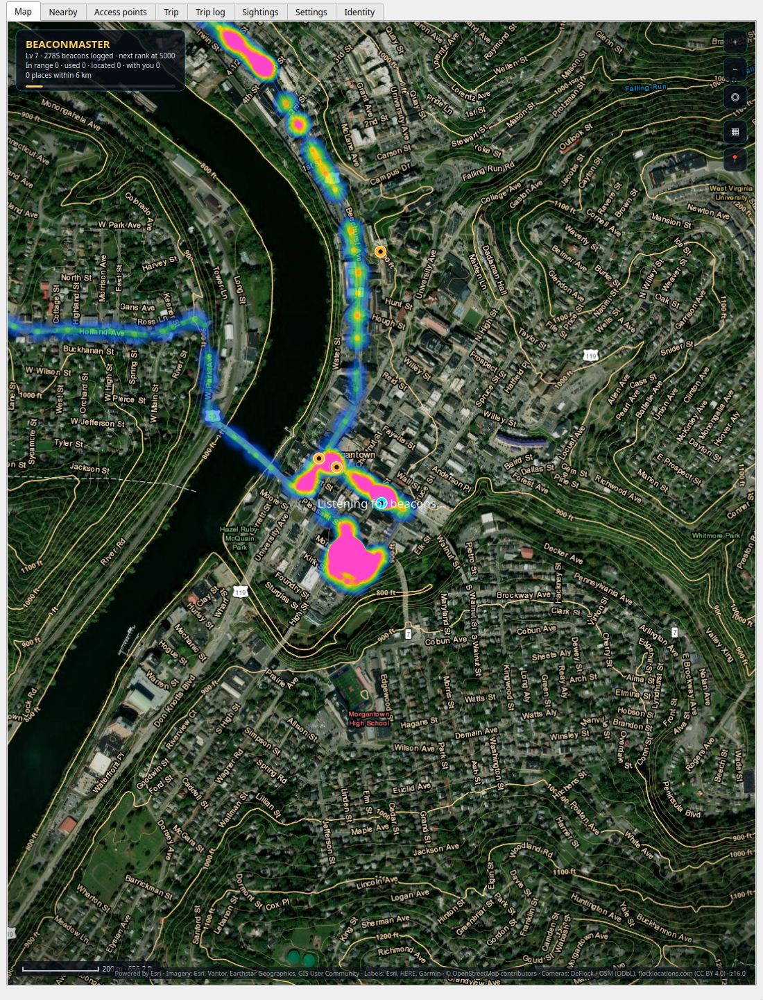
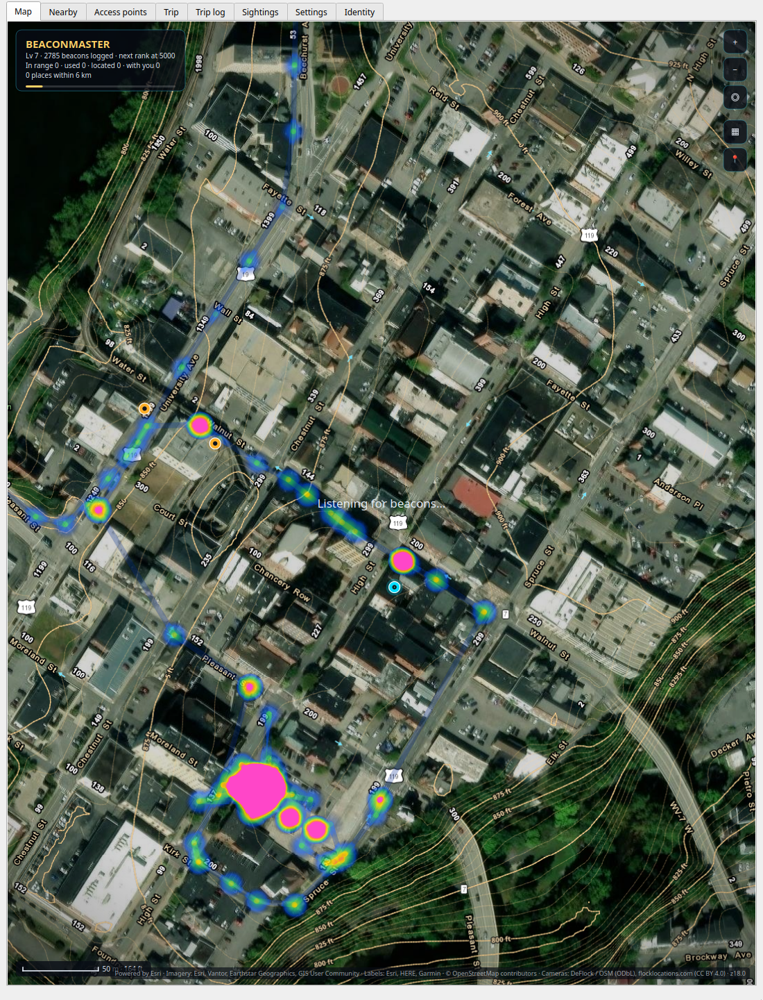
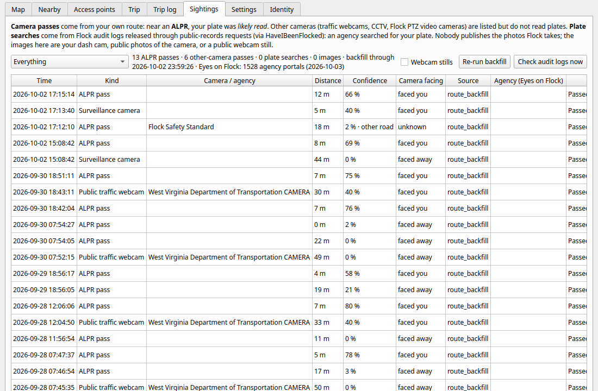

# BeaconFix

**Where am I, what is around me, and who is watching the road?** BeaconFix is a KDE Plasma 6 / Qt 6
locator for computers without GPS — a workstation in a motorhome, a laptop on a satellite link, a
desktop that moves — with an Android companion app and an optional self-hosted hub. It works out where
the machine is, maps the Wi-Fi beacons around it to within a few metres, keeps a trip log, warns about
automatic licence-plate-reader (ALPR) cameras on your route, and keeps an honest record of every
camera you drove past. Everything it learns goes into an encrypted personal database that never leaves
your devices unless you point it at your own hub.

<p align="center">
  
  
  
</p>

## Highlights

- **Position without GPS** — Starlink dish GPS, your own beacon map, BeaconDB, Apple's Wi-Fi
  positioning or IP, in that order; a site lock and Wi-Fi fingerprinting when you are parked.
- **A beacon map that tells you how sure it is** — every access point is positioned by a Bayesian
  estimator (grid posterior, robust least squares, correlated-shadowing covariance, per-device
  calibration) and graded A–F with an honest 95 % region. Measured against surveyed ground truth.
- **Satellite-hybrid map to street-furniture scale** — newest free imagery (Esri Clarity, USGS, NASA),
  roads, contours in feet, zoom to z23, area grouping, decluttered labels; 60 fps in the Plasma widget.
- **ALPR awareness** — the DeFlock camera map (ALPR-only, with real camera directions), a narrow
  field-of-view model per vendor, road snapping, and a plate-read probability for every pass. Alerts say
  what is true: *"you passed an ALPR camera — your plate was likely read"*.
- **Sightings log** — every camera pass and every public record of your plate being *searched*
  (released Flock audit logs via HaveIBeenFlocked, checked with a privacy-preserving hashed prefix) is
  stored with its metrics, images and a link to its source. Backfilled over your whole route history.
- **On-phone ALPR dash cam and live scanner**: real-time viewfinder with immediate plate bounding boxes,
  short-shutter frame analysis, per-vehicle tracking, multi-frame OCR fusion, and offline hotlist matching
  for AMBER / Silver / Blue alerts.
- **Camera-avoidance routing** — routes that steer around ALPR camera cones (OpenRouteService or
  GraphHopper, with your own free API key).
- **LoRa mesh and ESP32 radio nodes**: Heltec V3 and ESP32-S3 hardware monitors sniffing Wi-Fi deauth
  frames, rogue probe requests, and surveillance beacons in promiscuous mode; multi-hop LoRa mesh
  relaying telemetry, OLED trip dashboards, and Ed25519-signed OTA updates.
- **Your devices, linked in seconds** — QR or LAN discovery with Bluetooth-style numeric comparison;
  nothing to type. Optional hub over WireGuard with an end-to-end encrypted API (X25519 +
  ChaCha20-Poly1305).
- **Nearest help** — police, fire, the nearest ER and pediatric ER with phone numbers and drive times.

## Install

Requirements: KDE Plasma 6 for the widget (the app and tray run on any Qt 6 desktop), Qt 6.5+ (Core,
Gui, Widgets, Network, DBus, Sql with SQLite), OpenSSL, CMake 3.16+, a C++17 compiler, a Wi-Fi interface
managed by NetworkManager. Optional: `grpcurl` (Starlink tier), `avahi-utils` (LAN discovery), `cjxl` /
`djxl` from libjxl (lossless image storage), `ffmpeg` (opt-in traffic-webcam stills).

**One line** (clones into `~/.local/src/beaconfix`, offers to install the build packages, builds,
installs to `~/.local`, starts the tray, installs the widget):

```sh
curl -fsSL https://raw.githubusercontent.com/sworrl/beaconfix/master/get.sh | bash
```

**From a checkout:**

```sh
git clone https://github.com/sworrl/beaconfix.git && cd beaconfix
./install.sh            # -y --prefix DIR --no-widget --no-autostart --no-deps --no-restart
./uninstall.sh          # --purge also deletes the database, key, settings and tokens
```

**Debian package** (system-wide, includes the widget):

```sh
cmake -S . -B build-pkg -DCMAKE_INSTALL_PREFIX=/usr -DCMAKE_BUILD_TYPE=Release
cmake --build build-pkg -j"$(nproc)" && (cd build-pkg && cpack -G DEB)
sudo apt install ./build-pkg/beaconfix_*.deb
```

Then add **BeaconFix** through *Add Widgets*. The tray starts at login.

**Android app** (Android 8+): install the APK from the [releases](https://github.com/sworrl/beaconfix/releases)
page, open *Link a PC* and scan the QR the desktop shows (*Link a device…* in the tray menu). Building
it yourself: [android/README.md](android/README.md).

**Hub** (optional, self-hosted): a headless BeaconFix (`beaconfix --server`) in a container reachable
over your VPN only. See [deploy/README.md](deploy/README.md) and [docs/HUB.md](docs/HUB.md).

### Optional hardware
- **Wi-Fi RTT responder** — the phone measures its distance to the PC to about a metre (Intel AX210 or
  another card whose driver supports `ENABLE_FTM_RESPONDER`): `sudo ~/.local/share/beaconfix/setup-rtt-responder.sh`.
  [docs/RANGING.md](docs/RANGING.md) §6.
- **Raspberry Pi agent** — a GPS HAT as a precise position witness, BLE radio and NTP server:
  `agent/install-on-pi.sh <user>@<pi>`. [docs/AGENT.md](docs/AGENT.md).
- **Heltec V3 / ESP32-S3 LoRa mesh node**: an off-grid RF surveillance detector and gateway. Sniffs 802.11
  monitor frames and BLE beacons while meshing telemetry back to your desktop or Android phone over LoRa or USB.
  Includes an OLED trip dashboard and Ed25519-signed OTA updates: `tools/flash_heltec_v3.sh`.

## How it gets a fix

| tier | source | typical accuracy | needs |
|---|---|---|---|
| 0 | **Site lock** — parked where you surveyed an anchor, recognised by the Wi-Fi around it | the anchor | an anchor |
| 1 | **Starlink dish GPS** (`get_location` over gRPC on the dish) | ~10 m | `grpcurl`; local-network access enabled in the Starlink app |
| 2 | **Fingerprinting and the internal map** (beacons you have positioned) | 5–50 m | places you have been |
| 3 | **BeaconDB** (open Wi-Fi geolocation) | 30–150 m | coverage |
| 4 | **Apple Wi-Fi positioning** (keyless; can be switched off) | 30–500 m | coverage |
| 5 | **IP geolocation** | city | nothing |

Provider accuracies are calibrated against your own better fixes, so a claimed "±50 m" that is really
±400 m is treated as such. Access points that travel with you (hotspots, your home network, anything
heard far apart) never position anything. [docs/ESTIMATION.md](docs/ESTIMATION.md).

## Features

**Map** (app, widget, phone): satellite hybrid by default (Esri World Imagery and Clarity, USGS
imagery, NASA VIIRS), streets, dark and topographic styles, road and label overlays, contour lines in
feet drawn from elevation tiles, zoom to street-furniture scale (z23) with a metric/imperial scale bar,
grouping of nearby beacons into areas, a heat layer of everywhere you have been, and ALPR cameras with
their field of view. The Plasma widget renders at 60 fps. [docs/WIDGET.md](docs/WIDGET.md).

**Beacon positions you can trust**: samples become places (per device), a grid posterior integrates out
the unknown transmit power and path-loss exponent, a robust Levenberg–Marquardt fit refines it, and the
covariance accounts for correlated shadowing, GPS error, per-device antenna differences, and mirror
ambiguity on one-sided data. Each estimate gets a 95 % region, a score and a letter A–F (R for a region
only, M for something that moves). Monte Carlo and surveyed ground truth are in
[docs/GRADING.md](docs/GRADING.md); the desktop and the phone run line-for-line identical engines,
checked against shared golden vectors.

**ALPR cameras and plate events** ([docs/SIGHTINGS.md](docs/SIGHTINGS.md), [docs/DETECTION.md](docs/DETECTION.md)):
- The camera map is DeFlock's daily ALPR-only dataset (OpenStreetMap, ODbL) plus community reports;
  each camera is classified (ALPR, traffic webcam, PTZ, CCTV, enforcement) — only an ALPR reads plates.
- A **pass** is found on the polyline of your track (desktop, phone, synced trips), snapped to the road
  the camera watches (parallel roads, overpasses and the opposite carriageway are recognised), and
  scored as P(read) from the vendor's field of view, the fix error and the camera's trust.
- **Plate searches**: released Flock audit logs (via HaveIBeenFlocked) are checked for your registered
  plates on an adaptive schedule — slow when idle, faster while driving and after passing a camera
  whose agency publishes its logs. Only an 8-character hash prefix leaves your device.
- Agency context from Eyes on Flock transparency data (retention, search counts, data sharing).
- Every event keeps its metrics, the raw source record, a **View source** link, and images stored in
  the smallest lossless format (JPEG XL recompression, or lossless JPEG XL / WebP): public photos of the
  camera, your own dash-cam frame from the moment you passed, and (opt-in) a traffic-webcam still.
- Wi-Fi/BLE signatures of Flock hardware and other police equipment, one shared, tiered signature file
  for desktop and phone, tuned against public false-positive reports.

**Android app** ([android/README.md](android/README.md)): records beacons with the phone's GPS and
smoothed track, mirrors the desktop offline, detects camera passes live, runs the ALPR dash cam
(on-device detection and OCR, short-shutter capture, per-vehicle tracking and fusion, US plate-format
rules), shows Sightings with their images, measures Wi-Fi RTT ranges, and has a Help screen, widgets,
Quick Settings tiles and Android Auto support.

**Hub** ([docs/HUB.md](docs/HUB.md), [docs/SECURE-API.md](docs/SECURE-API.md), [docs/LINKING.md](docs/LINKING.md)):
the master database and a job queue on a small server; the desktop, a headless node and the phone do
the processing and sync through it. Every request is sealed with BFS3 (X25519, HKDF-SHA512 ratchet,
ChaCha20-Poly1305, replay window). Devices join by scanning a QR — no codes to type.

**Places and nearest help**: fuel, propane, camping, water, dump stations, laundry, groceries; police,
fire, hospitals with an ER, **pediatric ERs** with their confidence, urgent care, pharmacies; parks,
playgrounds and more — with addresses, phone numbers, hours and drive times.

**Wi-Fi security**: every beacon is graded (open, WEP, WPA1 … WPA3-SAE, OWE) with the reasoning spelled
out. [docs/SECURITY.md](docs/SECURITY.md).

**Trip**: distance, speed, heading, stops and dwell times, elevation and sun times per stop, places
visited, milestones, GPX export.

**Identity**: one Ed25519 identity across your devices, moved as an encrypted bundle or linked.
[docs/IDENTITY.md](docs/IDENTITY.md).

**OS integration** (opt-in): the system time zone follows the fix, the fix is published to GeoClue,
KWin Night Light follows your position, and locale hints are exposed to other widgets.

## Pieces

| piece | what |
|---|---|
| `beaconfix` | the Qt window: fix, map, Nearby, beacons, Sightings, trip, devices, settings |
| `beaconfix --tray` | the background locator: state, database, LAN API, tile server, plate events; D-Bus activated |
| `beaconfix --server` / `--node` | the hub, and a headless processing node |
| Plasma widget `org.kde.plasma.beaconfix` | Map, Nearby, Radar and Trip tabs — [docs/WIDGET.md](docs/WIDGET.md) |
| D-Bus `org.sworrl.BeaconFix` | properties, methods and signals — [docs/DBUS.md](docs/DBUS.md) |
| CLI | `beaconfix --help` |
| Android app `org.sworrl.beaconfix` | [android/README.md](android/README.md) |
| `firmware/heltec_v3/` | Heltec WiFi LoRa 32 V3 firmware: LoRa mesh, promiscuous Wi-Fi, BLE scanner, OLED dashboard |
| `firmware/esp32_node/` | ESP32-S3 node firmware: Wi-Fi monitor, BLE surveillance sniffing, signed mesh OTA |
| `tools/esp32_autolink.py` | auto-detection daemon bridging USB serial nodes and LoRa mesh to the BeaconFix API |
| `tools/mesh_flash.py` | over-the-air firmware distributor with Ed25519 cryptographic chunk signing |
| Pi agent | [docs/AGENT.md](docs/AGENT.md) |
| `tools/train-plate-detector/` | a clean (MIT code + CC BY data) retraining pipeline for the plate detector |

## Privacy

Nothing is sent to the author or to any BeaconFix service — there is none. What can leave your devices,
and to whom:

| when | to | what |
|---|---|---|
| a Wi-Fi fix is needed and your own map cannot answer | BeaconDB | BSSIDs and signal levels heard (home networks and the connected network excluded) |
| BeaconDB has no match (can be disabled) | Apple (`gs-loc.apple.com`) | the same BSSIDs, up to 30 |
| everything else failed (can be disabled) | ip-api.com | your public IP, implicitly |
| a fix is accepted | Nominatim (OpenStreetMap); timeapi.io if time-zone sync is on | the coordinates |
| places / roads near cameras are refreshed | Overpass (OpenStreetMap) | coordinates and a radius |
| a stop is logged (can be disabled) | Open Topo Data | the coordinates |
| the map is shown | the selected tile servers (OpenStreetMap, Esri, USGS, NASA GIBS, OpenTopoMap, CARTO, AWS terrain tiles) | tile coordinates |
| the camera map is refreshed | DeFlock (`data.dontgetflocked.com`), flocklocations.com | nothing (bulk downloads) |
| a camera you passed is looked up | OpenStreetMap API, Wikimedia Commons, Panoramax | the camera's OSM id / position |
| your plates are checked (adaptive schedule) | HaveIBeenFlocked | 8-hex-character SHA-256 prefixes of your plate variants — never the plate |
| agency context, weekly | Eyes on Flock | nothing (a bulk download) |
| the phone snaps a track to roads | OSRM demo server | the track's coordinates |
| opt-in: camera-avoiding route | OpenRouteService or GraphHopper (your key) | start, destination and the avoided areas |
| opt-in: traffic-webcam still | the state 511 operator | the camera id |
| opt-in, with your key | Mapillary | positions of the cameras you passed (for nearby street photos) |
| opt-in, with your token | WiGLE; Telegram (your own bot) | BSSIDs one at a time; the alerts you chose |

The LAN API answers only private addresses, only with a token, only from linked devices. The hub, if you
run one, is yours, behind your VPN, with an end-to-end encrypted API.

## Documentation

| | |
|---|---|
| [docs/ESTIMATION.md](docs/ESTIMATION.md), [docs/GRADING.md](docs/GRADING.md) | positioning and beacon estimation, grades, measured accuracy |
| [docs/SIGHTINGS.md](docs/SIGHTINGS.md), [docs/DETECTION.md](docs/DETECTION.md) | camera passes, plate searches, images, signatures |
| [docs/API.md](docs/API.md), [docs/DBUS.md](docs/DBUS.md) | the LAN API and the D-Bus interface |
| [docs/HUB.md](docs/HUB.md), [docs/SECURE-API.md](docs/SECURE-API.md), [docs/LINKING.md](docs/LINKING.md) | the hub, BFS3, linking devices |
| [docs/DATABASE.md](docs/DATABASE.md), [docs/CONFIGURATION.md](docs/CONFIGURATION.md) | the database, every setting and file |
| [docs/RANGING.md](docs/RANGING.md), [docs/AGENT.md](docs/AGENT.md) | Wi-Fi RTT / BLE ranging, the Pi agent |
| [docs/SECURITY.md](docs/SECURITY.md), [docs/IDENTITY.md](docs/IDENTITY.md) | threat model, Wi-Fi grading, identity |
| [docs/WIDGET.md](docs/WIDGET.md), [docs/DEVELOPMENT.md](docs/DEVELOPMENT.md) | the Plasma widget, building and testing |
| [docs/LICENSING.md](docs/LICENSING.md) | the license policy and every third-party component |
| [CHANGELOG.md](CHANGELOG.md) | release notes |

## License

Apache-2.0 — see [LICENSE](LICENSE) and [NOTICE](NOTICE). Third-party code, models and data keep their
own licenses ([docs/LICENSING.md](docs/LICENSING.md)); copyleft components live in separate modules or
optional downloads. Map and camera data © OpenStreetMap contributors (ODbL) via DeFlock; imagery and
data from Esri, USGS, NASA, OpenTopoMap, BeaconDB, Open Topo Data, Wikimedia Commons and Panoramax
contributors, Eyes on Flock (CC BY-SA 4.0), and the EFF short wordlist (CC BY 3.0 US).

## Contributing

Issues and pull requests are welcome; see [CONTRIBUTING.md](CONTRIBUTING.md). Contact:
github@falcontechnix.com.
