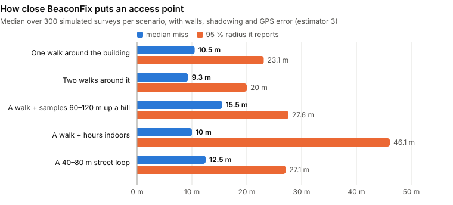
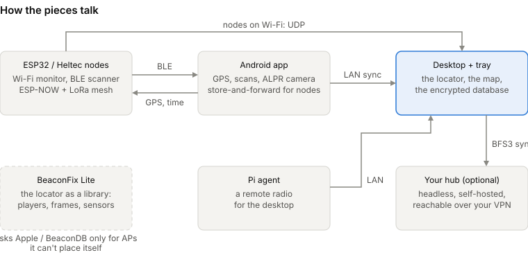
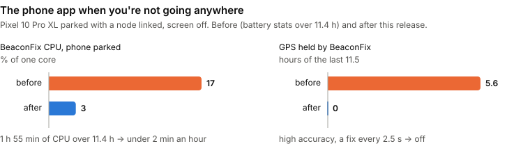
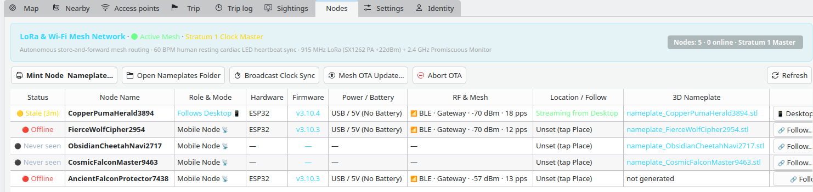
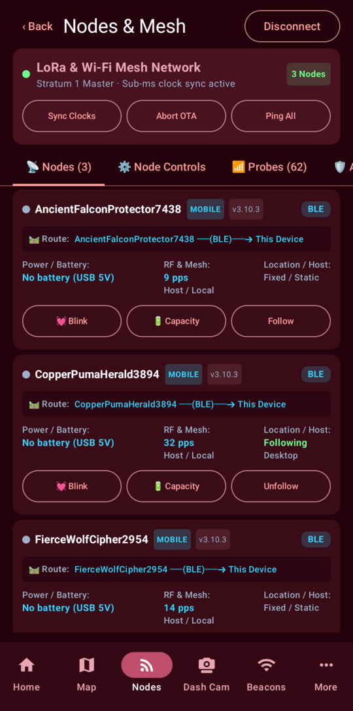
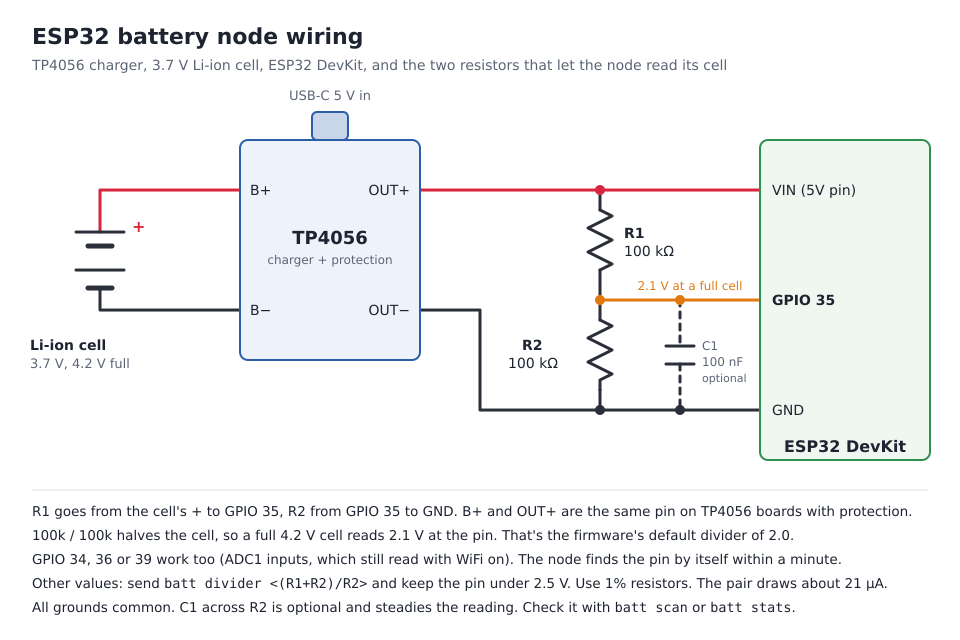
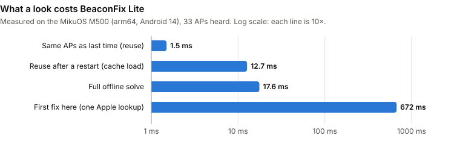

# BeaconFix

[](https://github.com/sworrl/beaconfix/releases/latest)
[](lite/README.md)
[](https://flasher.falcontechnix.com)
[](LICENSE)
[](https://github.com/sworrl/beaconfix/commits/master)
<br>


**Where am I, what's around me, and who's watching the road?**

BeaconFix works out where a computer is when it has no GPS. I built it for a workstation that lives in a
motorhome, but it's just as happy on a laptop on a satellite link or any desktop that moves. It maps the Wi-Fi
around it to within a few metres, keeps a trip log, warns you about licence-plate-reader (ALPR) cameras on your
route, and keeps an honest record of every camera you drove past.

There's an Android app that goes with it, small ESP32 radio nodes that listen for you, an optional hub you run
yourself, and BeaconFix Lite (the locator on its own, for other devices). Everything it learns goes into an
encrypted database that stays on your devices unless you point it at your own hub.

<p align="center">
  
  
  
</p>

## Install and update

Every line below is also the updater. Run it again and you get the newest release.

| What | One line |
|---|---|
| **Desktop** (builds from source into `~/.local`, starts the tray, adds the widget) | `curl -fsSL https://raw.githubusercontent.com/sworrl/beaconfix/master/get.sh \| bash` |
| **Desktop**, Debian/Ubuntu package (system-wide) | `curl -fsSLo /tmp/beaconfix.deb https://github.com/sworrl/beaconfix/releases/latest/download/beaconfix_amd64.deb && sudo apt install /tmp/beaconfix.deb` |
| **Android app** (phone on USB, debugging on) | `curl -fsSLo /tmp/beaconfix.apk https://github.com/sworrl/beaconfix/releases/latest/download/beaconfix.apk && adb install -r /tmp/beaconfix.apk` |
| **Android app**, no computer needed | open [flasher.falcontechnix.com](https://flasher.falcontechnix.com) on the phone and tap the download |
| **ESP32 or Heltec V3 node** | plug it in, open [flasher.falcontechnix.com](https://flasher.falcontechnix.com) in Chrome or Edge, pick the board |
| **Raspberry Pi agent** (from a checkout) | `agent/install-on-pi.sh <user>@<pi>` |
| **BeaconFix Lite** (a library for your own app) | `curl -fsSLO https://github.com/sworrl/beaconfix/releases/download/lite-v1.0.0/beaconfix-lite-1.0.0.aar` |

The flasher is new. If it gives you any trouble, `tools/flash_esp32.sh` and `tools/flash_heltec_v3.sh` do the same
thing from a checkout. Either way the board ends up taking updates signed with **your** key and nobody else's (see
[Firmware signing keys](#firmware-signing-keys)).

After installing, add **BeaconFix** through *Add Widgets*. The tray starts at login. On the phone, open *Link a PC*
and scan the QR the desktop shows (*Link a device…* in the tray menu). Nothing to type.

<details>
<summary>Requirements, building from a checkout, the hub</summary>

Requirements: KDE Plasma 6 for the widget (the app and tray run on any Qt 6 desktop), Qt 6.5+ (Core, Gui, Widgets,
Network, DBus, Sql with SQLite), OpenSSL, CMake 3.16+, a C++17 compiler, and a Wi-Fi interface managed by
NetworkManager. Optional: `grpcurl` (Starlink tier), `avahi-utils` (LAN discovery), `cjxl`/`djxl` from libjxl
(lossless image storage), `ffmpeg` (opt-in traffic-webcam stills). `get.sh` offers to install the build packages.

```sh
git clone https://github.com/sworrl/beaconfix.git && cd beaconfix
./install.sh            # -y --prefix DIR --no-widget --no-autostart --no-deps --no-restart
./uninstall.sh          # --purge also deletes the database, key, settings and tokens
```

Debian package from source:

```sh
cmake -S . -B build-pkg -DCMAKE_INSTALL_PREFIX=/usr -DCMAKE_BUILD_TYPE=Release
cmake --build build-pkg -j"$(nproc)" && (cd build-pkg && cpack -G DEB)
sudo apt install ./build-pkg/beaconfix_*.deb
```

The Android app: [android/README.md](android/README.md). The hub is a headless BeaconFix (`beaconfix --server`)
in a container that only your VPN can reach: [deploy/README.md](deploy/README.md) and [docs/HUB.md](docs/HUB.md).
</details>

## What it does

- **A position without GPS.** Starlink dish GPS, your own beacon map, BeaconDB, Apple's Wi-Fi positioning or IP,
  in that order. Parked somewhere you've surveyed, it locks to the site from the Wi-Fi around it.
- **A beacon map that says how sure it is.** Every access point gets placed by a Bayesian estimator and graded A
  to F with an honest 95 % region. The chart below is from the simulation study; the surveyed checks are in
  [docs/GRADING.md](docs/GRADING.md).
- **A satellite-hybrid map down to street furniture.** The newest free imagery (Esri Clarity, USGS, NASA), roads,
  contours in feet, zoom to z23. 60 fps in the Plasma widget.
- **ALPR awareness.** The DeFlock camera map (ALPR-only, with real camera directions), a field-of-view model per
  vendor, road snapping, and a plate-read probability for every pass. The alert says what's true: *you passed an
  ALPR camera, your plate was likely read*.
- **A sightings log.** Every camera pass, and every public record of your plate being *searched* (released Flock
  audit logs via HaveIBeenFlocked, checked with a hashed prefix so the plate never leaves), with its numbers,
  images and a link to the source. It backfills over your whole route history too.
- **A dash cam on the phone.** Live plate boxes, short-shutter frames, per-vehicle tracking, OCR fused over several
  frames, and offline hotlist matching for AMBER, Silver and Blue alerts.
- **Routes around cameras.** Steers around ALPR cones (OpenRouteService or GraphHopper, with your own free key).
- **Radio nodes.** ESP32 and Heltec V3 boards that watch Wi-Fi (probes, beacons, deauths) and BLE, and mesh what
  they hear back to you over ESP-NOW (plus LoRa on the Heltec). One can ride along with your phone and hold what
  it hears until the phone is back.
- **Your devices, linked in seconds.** A QR or LAN discovery with a matching code on both screens. The optional hub
  sits behind WireGuard with an end-to-end encrypted API (X25519 + ChaCha20-Poly1305).
- **Nearest help.** Police, fire, the nearest ER and pediatric ER, with phone numbers and drive times.

<p align="center"></p>

The radius it reports covers the real spot about 95 % of the time, which is the point. The miss itself stays
around 10 m because that's what walls and shadowing allow from the outside of a building. Building-level, not
metre-level, and the map says so.

## How the pieces talk

<p align="center"></p>

| Piece | What it is |
|---|---|
| `beaconfix` | the window: fix, map, Nearby, beacons, Sightings, trip, devices, settings |
| `beaconfix --tray` | the background locator: state, database, LAN API, tile server, plate events (D-Bus activated) |
| `beaconfix --server` / `--node` | the hub, and a headless processing node |
| Plasma widget `org.kde.plasma.beaconfix` | Map, Nearby, Radar and Trip tabs ([docs/WIDGET.md](docs/WIDGET.md)) |
| D-Bus `org.sworrl.BeaconFix` | properties, methods and signals ([docs/DBUS.md](docs/DBUS.md)) |
| Android app `org.sworrl.beaconfix` | [android/README.md](android/README.md) |
| `firmware/esp32_node/`, `firmware/heltec_v3/` | node firmware: Wi-Fi monitor, BLE scanner, mesh, signed OTA (and LoRa plus an OLED on the Heltec) |
| `tools/esp32_autolink.py` | the bridge service: USB and BLE links to nodes, relayed to the desktop on UDP 47824 |
| `tools/sign_firmware.py`, `tools/mesh_flash.py` | your firmware key, and signed images sent over the mesh |
| `agent/` | the Pi agent ([docs/AGENT.md](docs/AGENT.md)) |
| `lite/` | BeaconFix Lite ([lite/README.md](lite/README.md)) |
| `tools/train-plate-detector/` | a clean (MIT code, CC BY data) pipeline to retrain the plate detector |

## How it gets a fix

| Tier | Source | Typical accuracy | Needs |
|---|---|---|---|
| 0 | **Site lock**, parked where you surveyed an anchor, recognised by the Wi-Fi around it | the anchor | an anchor |
| 1 | **Starlink dish GPS** (`get_location` over gRPC on the dish) | ~10 m | `grpcurl`, local-network access on in the Starlink app |
| 2 | **Fingerprinting and your own map** (beacons you've positioned) | 5–50 m | places you've been |
| 3 | **BeaconDB** (open Wi-Fi geolocation) | 30–150 m | coverage |
| 4 | **Apple Wi-Fi positioning** (no key, can be switched off) | 30–500 m | coverage |
| 5 | **IP geolocation** | the city | nothing |

Each provider's claimed accuracy gets checked against your own better fixes, so a "±50 m" that's really ±400 m is
treated as ±400 m. Access points that travel with you (hotspots, your home network, anything heard far apart) never
position anything. More in [docs/ESTIMATION.md](docs/ESTIMATION.md).

## The phone app

Records beacons with the phone's GPS and a smoothed track, mirrors the desktop when you're away from it, catches
camera passes live, runs the ALPR dash cam, shows Sightings with their images, measures Wi-Fi RTT ranges to the
desktop, and has a Help screen, widgets, Quick Settings tiles and Android Auto. It also knows when you're not
going anywhere. Sitting still it turns its own GPS off, slows its scans and the node link down, and stops the
screens' database work when the screen goes off, then picks it all back up the moment you move (the phone's
significant-motion sensor wakes it).

<p align="center"></p>

## Mesh nodes

The nodes sniff Wi-Fi and BLE and pass what they hear along an ESP-NOW mesh (plus LoRa on the Heltec V3). Any node
with a USB or BLE client is the gateway for the rest, so only one of them needs to be in reach.

How the desktop hears them:

- **USB**: plug one in. The `beaconfix-esp32-bridge` user service (`tools/esp32_autolink.py`) finds it.
- **BLE**: the same service links to up to 4 nodes in Bluetooth range (needs `python3-bleak`, `--no-ble` turns it
  off).
- **Phone**: the Android app links to a node over BLE and relays it onto the LAN, both ways. If the desktop has no
  Bluetooth (or it died on you), the phone covers it.
- **WiFi**: a node on your WiFi broadcasts on UDP 47824 and takes commands on UDP 47825, so it needs no Bluetooth
  at all. A node that isn't on WiFi still shows up as present when the desktop's WiFi scan sees its access point
  (the SSID is the node's name).

A node goes offline after 2 minutes of silence.

Commands from the desktop (Blink, clock sync, OTA, battery, etc) go to the bridge on 127.0.0.1:47825. It hands them
to its own USB and BLE links, and sends whatever it can't deliver to the nodes and phones it's heard from on the
LAN. Plenty of WiFi setups (UniFi included) drop broadcasts from wired machines to wireless clients, so it sends to
each one's address directly. `@NodeName <cmd>` goes to that node only.

### Putting nodes on WiFi

Nodes > **Put Nodes on WiFi…**, then the network name and password. It goes to every node the desktop can reach
(USB, BLE, or through the phone) and each one switches to WiFi in its link column once it joins. The network has to
be 2.4 GHz and on the same LAN as the desktop. WPA2 and WPA3 both work.

For a node nothing can reach yet, join its access point (open, named after the node) and open
`http://192.168.4.1`. The Home Wi-Fi card on that page does the same thing. Over serial or BLE it's
`wifi connect "Network Name" password` (the quotes are only needed when the name has spaces).

A node on WiFi only takes commands from that network. Its own access point stays open for setup and signed OTA, but
UDP commands from it are ignored.

### A node that follows your phone

Link a node to the Android app and it follows that phone. The app streams its GPS and the time to it, and saves
everything the node detects (probe requests, beacons, deauths, BLE trackers) in its own database with the position
the node had. The next sync sends them on (`/db/sync`, `nodeDetections`): to the hub when the phone is enrolled with
one, otherwise to each paired desktop. Either one has them at `GET /api/v1/node-detections`.

When the phone is out of BLE range the node keeps what it detects on its own flash (128 KB on an ESP32 DevKit,
1.5 MB on a Heltec V3, oldest dropped first, one beacon per AP a minute so it lasts) and hands it all over when the
phone is back. It only deletes what the phone confirms it saved. `sf status` shows what's stored, `sf clear` empties
it. A node that's on WiFi sends straight to the desktop instead. Over BLE it sends the phone only what the phone
keeps (one beacon per AP a minute, one probe or tracker per device every 30 s), so the link stays quiet.

### The node list

<p align="center">
  
  
</p>

The desktop's Nodes tab, the app's Nodes screen, the tray's Mesh Network menu, the widget's Trip tab and the web
dashboard all show the same list. For each node:

- **Status**: online, offline, or never seen (the desktop table also shows stale for a node heard in the last 10
  minutes). A node you minted a nameplate for but never powered up stays never seen until it checks in.
- **Role**: mobile or base station. A node can follow a device (your desktop or phone) and take its position from it.
- **Hardware and firmware**: the board and version it reports, or a dash if it hasn't said yet.
- **Power**: battery % and voltage with an estimate of runtime left, or "USB / 5V (No Battery)" when there's no cell
  on the ADC. See [Battery](#battery) for the two resistors that make a battery readable.
- **Link**: USB with its port, BLE, WiFi, or how many mesh hops away and through which node.
- **Location**: unset until you place it on the map, fixed once placed, or streaming from the device it follows.

Both screenshots are from my own nodes. The desktop one was taken with location turned off (no scan, no fix), and
the phone shot is cropped to the list. Nothing in either one shows where they are.

### Firmware signing keys

Each install signs its own firmware. The first time you run a flash script (or `tools/sign_firmware.py --init`) it
makes an ECDSA P-256 keypair in `tools/keys/` and writes the public half into `firmware/*/FwPublicKey.h`. Neither is
committed. Boards you flash after that only take OTA updates signed with your key, and the signing step refuses a
binary built for a different key.

The flasher works the same way. The firmware it hosts is built from this repo with a throwaway key whose private half
was thrown away, and the page writes your own key into the image in your browser before it flashes. Keep the key
files it gives you, and give every board in one mesh the same key.

Back up `tools/keys/firmware_sign.key`. If you lose it, the boards you flashed need USB to take a new one.

OTA without USB: join the node's open access point (its name) and send the signed image to its web server,
`curl -F update=@firmware.bin -F signature=@firmware.bin.sig http://192.168.4.1/update`, or use `tools/mesh_flash.py`
through a USB-connected node to reach the rest of the mesh.

### Battery

An ESP32 can't see its cell unless the cell's voltage reaches an ADC pin, so a battery node needs two resistors
besides the TP4056: 100 kΩ from the TP4056's B+ (or OUT+, the same pin on boards with protection) to GPIO 35 (34, 36
or 39 work too) and 100 kΩ from that pin to GND, with the TP4056 and ESP32 grounds tied together. The node finds
whichever of those pins has the cell within a minute and remembers it. Without the divider every pin floats around
0.3 V and the node reports no battery.



The same diagram is under Nodes > Battery Wiring… on the desktop, in the battery card of the app's Nodes screen, and
on the node's own setup page. `docs/battery-wiring.svg` is the source, and `tools/render_wiring.py` makes the copies
the apps and firmware use.

Battery nodes learn their own empty and full voltages over a few charge cycles instead of using a stock table, and
filter out the dips from radio transmits. Runtime left comes from how fast that node's % has actually been falling,
or from capacity and a typical draw (about 150 mA for an ESP32 with Wi-Fi and BLE on) until there's enough history.

Serial or BLE commands: `batt stats`, `batt scan` (what each pin reads), `batt pin <n>` / `batt pin auto`,
`batt divider <r>`, `batt reset` (also a button in the app). To send one through the bridge:
`echo '@NodeName batt scan' | nc -u -w1 127.0.0.1 47825` (leave off `@NodeName` to send it to every linked node).

### Optional hardware

- **Wi-Fi RTT responder**: the phone measures its distance to the PC to about a metre (an Intel AX210, or another
  card whose driver supports `ENABLE_FTM_RESPONDER`): `sudo ~/.local/share/beaconfix/setup-rtt-responder.sh`. See
  [docs/RANGING.md](docs/RANGING.md) §6.
- **Raspberry Pi agent**: a GPS HAT as a precise position witness, a BLE radio and an NTP server.
  [docs/AGENT.md](docs/AGENT.md).

## BeaconFix Lite

[`lite/`](lite/README.md) is the locator on its own, as a small library for devices that only need to know where they
are: a music player, a picture frame, a sensor box. Wi-Fi scan in, position out, using the same robust estimator and
integrity check as the desktop. No GPS, no Google Play services, and as little battery, network and flash as the
answer allows. Plain Kotlin, Android 5.0+, no dependencies. It runs on the MikuOS M500 today.

<p align="center"></p>

Most looks never touch the network. The same APs as last time just get the last fix back, and one lookup brings in
about a hundred neighbouring APs, so the rest of the area gets solved on the device. Lite releases are tagged
`lite-vX.Y.Z` with the `.aar`, a JVM core jar and the sources, and they're versioned separately from the desktop and
app (`vX.Y.Z`). `tools/release_lite.sh` builds, tests and publishes one.

## More of what's in it

**Map** (app, widget, phone): satellite hybrid by default (Esri World Imagery and Clarity, USGS imagery, NASA VIIRS),
streets, dark and topographic styles, road and label overlays, contours in feet from elevation tiles, zoom to
street-furniture scale (z23) with a metric/imperial scale bar, nearby beacons grouped into areas, a heat layer of
everywhere you've been, and ALPR cameras with their field of view. [docs/WIDGET.md](docs/WIDGET.md).

**Beacon positions you can trust**: samples become places (per device), a grid posterior integrates out the unknown
transmit power and path-loss exponent, a robust Levenberg–Marquardt fit refines it, and the covariance accounts for
correlated shadowing, GPS error, per-device antenna differences and mirror ambiguity on one-sided data. Each estimate
gets a 95 % region, a score and a letter A to F (R for a region only, M for something that moves). The desktop and
the phone run line-for-line identical engines, checked against shared golden vectors.
[docs/GRADING.md](docs/GRADING.md).

**ALPR cameras and plate events** ([docs/SIGHTINGS.md](docs/SIGHTINGS.md), [docs/DETECTION.md](docs/DETECTION.md)):
- The camera map is DeFlock's daily ALPR-only dataset (OpenStreetMap, ODbL) plus community reports. Each camera is
  classified (ALPR, traffic webcam, PTZ, CCTV, enforcement), and only an ALPR reads plates.
- A **pass** is found on the polyline of your track (desktop, phone, synced trips), snapped to the road the camera
  watches (parallel roads, overpasses and the opposite carriageway are recognised), and scored as P(read) from the
  vendor's field of view, the fix error and the camera's trust.
- **Plate searches**: released Flock audit logs (via HaveIBeenFlocked) are checked for your registered plates on an
  adaptive schedule (slow when idle, faster while driving and after passing a camera whose agency publishes its
  logs). Only an 8-character hash prefix leaves your device.
- Agency context from Eyes on Flock transparency data (retention, search counts, data sharing).
- Every event keeps its numbers, the raw source record, a **View source** link, and its images in the smallest
  lossless format (JPEG XL recompression, or lossless JPEG XL / WebP): public photos of the camera, your own dash-cam
  frame from the moment you passed, and (opt-in) a traffic-webcam still.
- Wi-Fi/BLE signatures of Flock hardware and other police equipment, in one shared, tiered file for the desktop and
  the phone, tuned against public false-positive reports.

**Hub** ([docs/HUB.md](docs/HUB.md), [docs/SECURE-API.md](docs/SECURE-API.md), [docs/LINKING.md](docs/LINKING.md)):
the master database and a job queue on a small server. The desktop, a headless node and the phone do the processing
and sync through it. Every request is sealed with BFS3 (X25519, an HKDF-SHA512 ratchet, ChaCha20-Poly1305, a replay
window). Devices join by scanning a QR, or a phone already linked to a PC can join that PC's hub with one tap.

**Places and nearest help**: fuel, propane, camping, water, dump stations, laundry, groceries; police, fire,
hospitals with an ER, **pediatric ERs** with their confidence, urgent care, pharmacies; parks, playgrounds and more,
with addresses, phone numbers, hours and drive times.

**Wi-Fi security**: every beacon is graded (open, WEP, WPA1 … WPA3-SAE, OWE) with the reasoning spelled out.
[docs/SECURITY.md](docs/SECURITY.md).

**Trip**: distance, speed, heading, stops and dwell times, elevation and sun times per stop, places visited,
milestones, GPX export.

**Identity**: one Ed25519 identity across your devices, moved as an encrypted bundle or linked.
[docs/IDENTITY.md](docs/IDENTITY.md).

**OS integration** (opt-in): the system time zone follows the fix, the fix is published to GeoClue, KWin Night Light
follows your position, and locale hints are there for other widgets.

## Privacy

Nothing goes to me or to any BeaconFix service, because there isn't one. Here's everything that can leave your
devices, and to whom:

| When | To | What |
|---|---|---|
| a Wi-Fi fix is needed and your own map can't answer | BeaconDB | BSSIDs and signal levels heard (home networks and the connected network left out) |
| BeaconDB has no match (can be switched off) | Apple (`gs-loc.apple.com`) | the same BSSIDs, up to 30 |
| everything else failed (can be switched off) | ip-api.com | your public IP, implicitly |
| a fix is accepted | Nominatim (OpenStreetMap), and timeapi.io if time-zone sync is on | the coordinates |
| places and roads near cameras are refreshed | Overpass (OpenStreetMap) | coordinates and a radius |
| a stop is logged (can be switched off) | Open Topo Data | the coordinates |
| the map is shown | the tile servers you picked (OpenStreetMap, Esri, USGS, NASA GIBS, OpenTopoMap, CARTO, AWS terrain tiles) | tile coordinates |
| the camera map is refreshed | DeFlock (`data.dontgetflocked.com`), flocklocations.com | nothing (bulk downloads) |
| a camera you passed is looked up | OpenStreetMap API, Wikimedia Commons, Panoramax | the camera's OSM id or position |
| your plates are checked (adaptive schedule) | HaveIBeenFlocked | 8-hex-character SHA-256 prefixes of your plate variants, never the plate |
| agency context, weekly | Eyes on Flock | nothing (a bulk download) |
| the phone snaps a track to roads | OSRM demo server | the track's coordinates |
| opt-in: a camera-avoiding route | OpenRouteService or GraphHopper (your key) | start, destination and the avoided areas |
| opt-in: a traffic-webcam still | the state 511 operator | the camera id |
| opt-in, with your key | Mapillary | positions of the cameras you passed (for nearby street photos) |
| opt-in, with your token | WiGLE, Telegram (your own bot) | BSSIDs one at a time, the alerts you chose |

The LAN API only answers private addresses, only with a token, only from linked devices. The hub, if you run one, is
yours, behind your VPN, with an end-to-end encrypted API.

## Documentation

| | |
|---|---|
| [docs/ESTIMATION.md](docs/ESTIMATION.md), [docs/GRADING.md](docs/GRADING.md) | positioning and beacon estimation, grades, measured accuracy |
| [docs/SIGHTINGS.md](docs/SIGHTINGS.md), [docs/DETECTION.md](docs/DETECTION.md) | camera passes, plate searches, images, signatures |
| [docs/API.md](docs/API.md), [docs/DBUS.md](docs/DBUS.md) | the LAN API and the D-Bus interface |
| [docs/HUB.md](docs/HUB.md), [docs/SECURE-API.md](docs/SECURE-API.md), [docs/LINKING.md](docs/LINKING.md) | the hub, BFS3, linking devices |
| [docs/DATABASE.md](docs/DATABASE.md), [docs/CONFIGURATION.md](docs/CONFIGURATION.md) | the database, every setting and file |
| [docs/RANGING.md](docs/RANGING.md), [docs/AGENT.md](docs/AGENT.md) | Wi-Fi RTT and BLE ranging, the Pi agent |
| [docs/SECURITY.md](docs/SECURITY.md), [docs/IDENTITY.md](docs/IDENTITY.md) | threat model, Wi-Fi grading, identity |
| [docs/WIDGET.md](docs/WIDGET.md), [docs/DEVELOPMENT.md](docs/DEVELOPMENT.md) | the Plasma widget, building and testing |
| [docs/LICENSING.md](docs/LICENSING.md) | the license policy and every third-party component |
| [lite/README.md](lite/README.md) | BeaconFix Lite: the library, its accuracy and costs, its releases |
| [CHANGELOG.md](CHANGELOG.md) | release notes |

The charts in this README are drawn by `tools/render_readme_charts.py` from the numbers in it, each one with where it
was measured.

## License

Apache-2.0, see [LICENSE](LICENSE) and [NOTICE](NOTICE). Third-party code, models and data keep their own licenses
([docs/LICENSING.md](docs/LICENSING.md)), and copyleft components live in separate modules or optional downloads. Map
and camera data © OpenStreetMap contributors (ODbL) via DeFlock. Imagery and data from Esri, USGS, NASA, OpenTopoMap,
BeaconDB, Open Topo Data, Wikimedia Commons and Panoramax contributors, Eyes on Flock (CC BY-SA 4.0), and the EFF
short wordlist (CC BY 3.0 US).

## Contributing

Issues and pull requests are welcome, see [CONTRIBUTING.md](CONTRIBUTING.md). Contact: github@falcontechnix.com.
